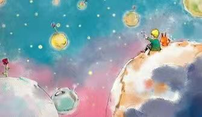
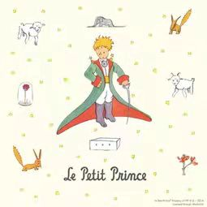
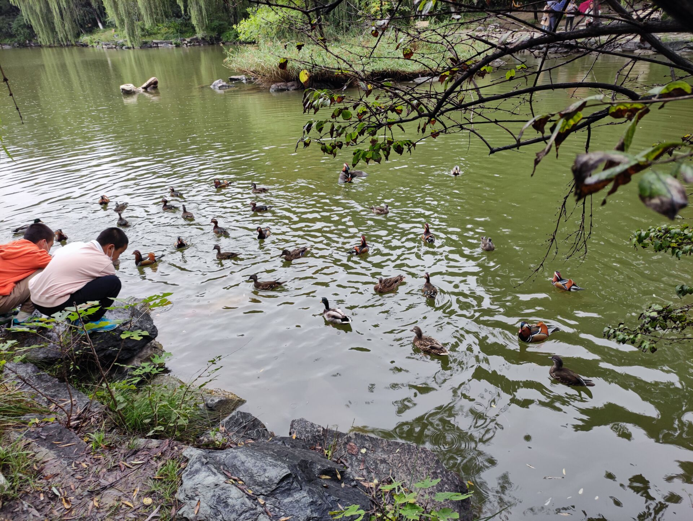
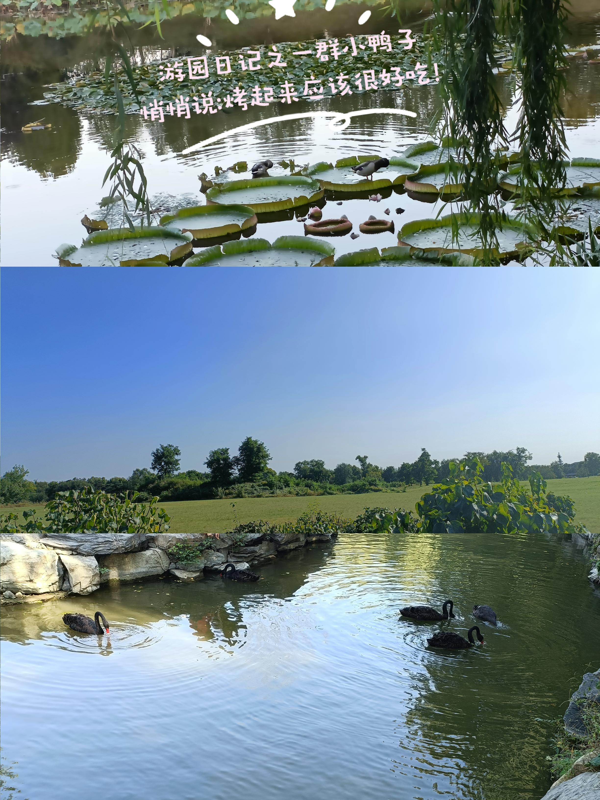
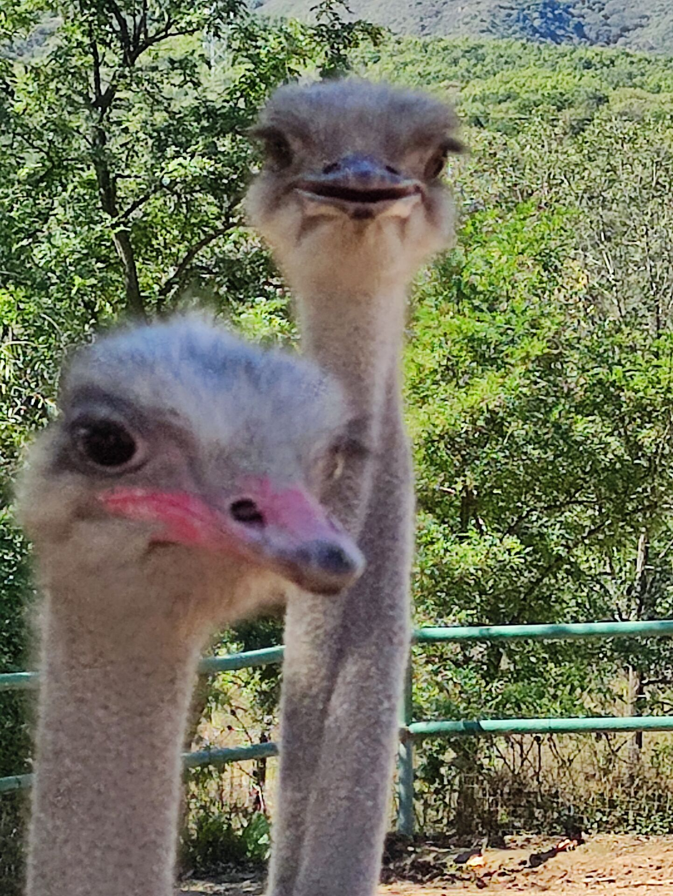
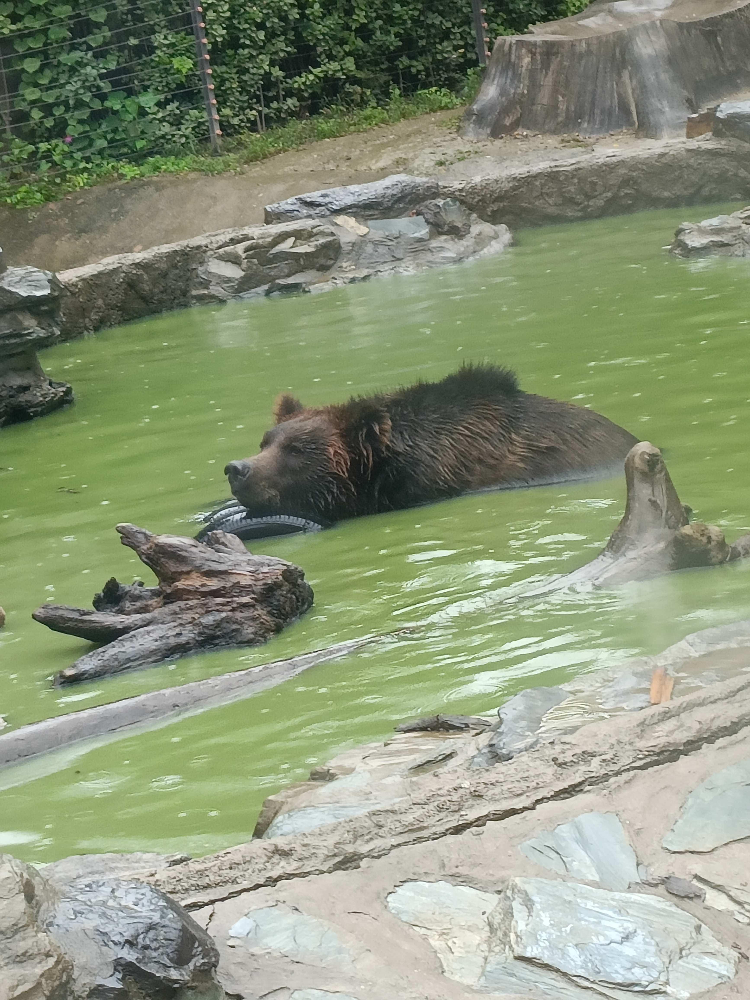

<!DOCTYPE html>
<html lang="lang="zh-cn">
<head>
   <link rel="stylesheet"href="te.css"type="text/css"/>
 </head>                                                      
<table border="0">
  <tr>
    <td width="75%">
      <h1><strong>刘艺硕</strong></h1>
      
<b>北京大学</b>

      
<b>学院：药学院</b>

      
<b>地址：北京市海淀区</b>

      
<b>邮箱：623618204@qq.com</b>

    </td>
     <td width="25%">
       
    </td>
  </tr>
</table>
<body>
 <h1>something about my likes</h1>
 <h2>No.1.小王子（Le Petit Prince)</h2>
        
    
“看东西用眼睛是看不清楚的，要用心去看”《小王子》不仅仅是一部给孩子看的童话，更是哲理与思考的结晶，充满了对人生的感悟，鞭笞世界上的丑恶现象，展现一个绵延不断的经验流中的人生本质

    
狐狸说：“对我来说，你只是一个小男孩，就像其他成千上万个小男孩一样没有什么两样。我不需要你。你也不需要我。对你来说，我也只是只狐狸，和其他成千上万的狐狸没有什么不同。但是，如果你驯养了我，我们就会彼此需要。对我来说，你就是我的世界独一无二的了；我对你来说，也是你世界的唯一”如果不去遍历世界，我们就不知道什么事我们精神和情感的寄托，但我们一旦遍历了世界，却发现我们再也无法回到那美好的地方去了。当我们开始寻求，我们根本无法知道自己身边的一切是如此可贵。

                                                
 <h2>No.2 <a hrep="https://author.baidu.com.">王俊凯</a></h2>
 <h2>No.3体育爱好</h2>
    <ul>
      <li>羽毛球🏸</li>
      <li>跑步（强调，慢跑！因为快跑也跑不动ಥ_ಥ）</li>
    </ul>                                       
 <h2>No.4其他一些奇奇怪怪的爱好🐷</h2>
      <ul>
        <li>喜欢吃吃吃！  天大地大，肚子最大！</li>                                   
        <li>喜欢发“呜呜呜”和狗头🐶  开心难过都是“呜呜呜”，自行切换语调</li>
        <li>出门游玩  开心加倍(≧∇≦)/
             顺便放几张出去快乐玩耍的照片!٩(๑^o^๑)⬇️
  

          
       
         
      
       
  </>                                     
<li>No.5有待填充...</li>
</ul>
 <h1>愿望清单</h1>
   
探寻新的美食店！  冲冲冲！

    
天安门看升国旗
                                       
    
在山上看日出
   
 <h1>  ﾍ⌒ヽﾌ

（　・ω・）　谢谢~~

/ ~つと）</h1>
 </body>
 </html>                                    
                                                   
